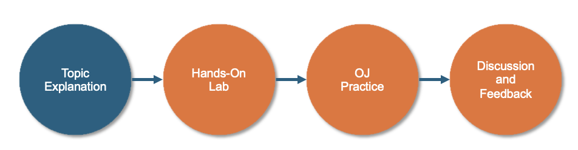

# 電腦程式與計算分析(一)   Python 與 AI 數據分析
> 
> 
> 
 

- 本課程針對初學者設計，以 Python 為核心工具，培養程式思維
- 課程教材請掃描右方QR Code 或連接至GitHub https://github.com/mingfujacky/Lecture-Python.git

# 課程講師 - 林志偉 (Jacky Lin)

+ 現職: 陽明交通大學助理教授 學士後電子與光子學程 
+ 學歷: 交通大學 資訊管理博士
+ 經歷: 台積電 資訊科技部門(IT)
+ 專長: 資料工程、程式設計、巨量資料分析
+ Email: jacky.jw.lin@nycu.edu.tw

# 課程規劃
+ **課程目標**
  + 養成問題拆解與運算思維，設計流程解決實務問題
  + 熟悉 Python 程式語法：變數、條件、迴圈、函式
  + 實作資料分析工具：Numpy、Matplotlib
  + 探索 AI 輔助程式設計 (Vibe Coding)
+ **授課方式**

    

# 課程大綱

# 🧠 練習跟理解很重要！

>我鼓勵你「手動輸入」而非複製貼上，這能幫助你產生寫程式的「肌肉記憶」，並強化理解。

# Supplement
# Survey: 對於Python程式開發的掌握度?
- A : 第一次學習程式設計
- B : 沒學過Python, 但學習過其他程式
- C : 上過Python課程，但沒用在工作上
- D : 平常工作有在用

Class |A   |B   |C   |D   
------|----|----|----|---
光子01 |38% |37% |22% |3%
光電02 |56% |13% |28% |3%
半製02 |57% |17% |26% |0%
新尖兵 |38% |27% |35% |0%
學士後 |68% |18% |14% |0%

# Survey: 對於本次Python課程的期待?
- 0 : 沒有特別期待，只是因為它在本次訓練的課程中
- 1 : 透過了解Python，放大已經具備的行業經驗價值，提升職涯高度。
- 2 : 完成基礎課程後，繼續進階學習，目標從事資料分析或機器學習

Class |0   |1   |2      
------|----|----|----
光子01 |0% |51% |49%
光電02 |4% |42% |54%
半製02 |0% |83% |17%
新尖兵 |0% |50% |50%
學士後 |0% |91% |9%

# 520012 電腦程式與計算分析(一) 課程相關資訊
- TA: 何宇文 wayneho4415@gmail.com; 林駿樺 abd90107sc.14@nycu.edu.tw
 
- Google meet: https://meet.google.com/diy-eivm-ymc
- Textbook: Python Basics: A Practical Introduction to Python 3. David Amos et al. 2023. 
(中文版 https://www.books.com.tw/products/0010955256?sloc=main)
- Instructional Arrangements
  - Laptop is required to practice hands-on sessions in class.
  - Deliver final project in group (<= 3 members) or individual. The project topic is related to Python coding. (eg. data analysis, game development, web scraping, application design)
  - Overdue assignments or reports won't be accepted.

# 520012 電腦程式與計算分析(一) 評分方式
- Attendance(10%): 5 roll calls 
  - 2 points for full attendance
  - 1 point for excused absence (with approved leave)
  - 0 point for unexcused absence
- Assignment (10%): 2 assignments will be given
- 40 questions in OJ system (20%): 4 submissions @ 9/26, 10/31, 11/28, 12/26
- Mid-term exam (20%): closed-book written exam @ 10/31
- Final-term exam (20%): closed-book written exam @ 12/19
- Final project oral presentation (10%): 12/05 or 12/12
- Final project written report (10%): 12/26

# 520012 電腦程式與計算分析(一) 課程綱要
[114 1st Semester](https://timetable.nycu.edu.tw/?r=main/crsoutline&Acy=114&Sem=1&CrsNo=520012&lang=)  

# Recommended TOC of Final Report
- **Requirements** we plan to fulfill and/or **problems** we plan to solve
- Teaming (roles and peer evaluation (1~10 points))
- User requirements and business rules
- Application briefings (systems architecture, main function screen shot) 
- Lesson learned
- Final project oral presentation: 12/05 16組, 12/12 16組, 共32組, 每組10分鐘
- Final project written report:12/26 23:59 

# Roles in Project
A group can have 1 to 4 members. Possible roles include:
  - Project Manager: team organization, schedule control, communication and report
  - User: define business rule and requirements
  - Designer: design data flow diagrams and functional specifications
  - Developer: develop code and conduct testing

