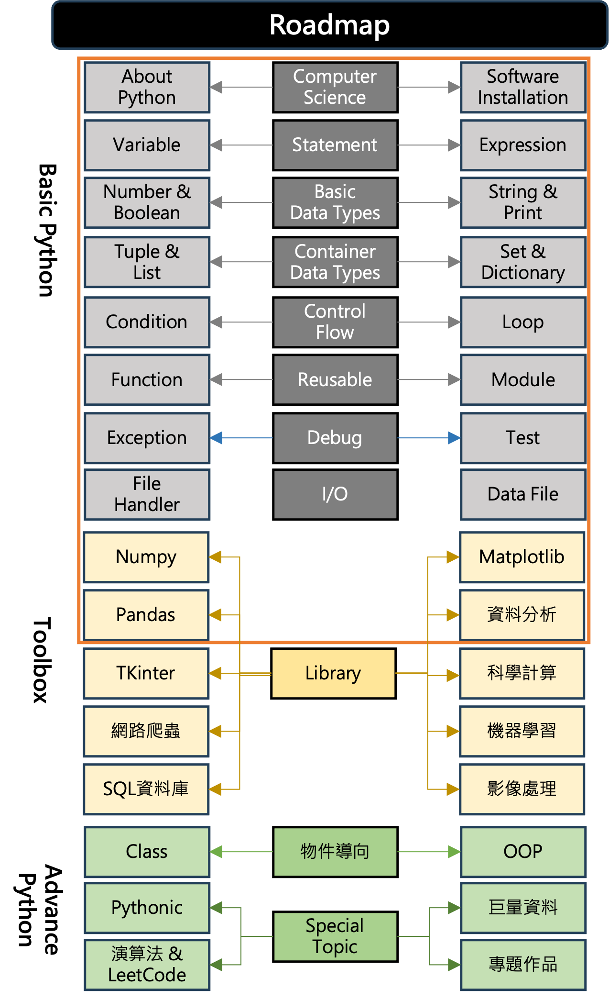

# Python 與 AI 數據分析
- 講師：林志偉
- 時數：40 小時
- 教材：https://github.com/mingfujacky/Lecture-Python.git

---
# 課程講師 - 林志偉 (Jacky Lin)

- #### 現職: 陽明交通大學 / 學士後電子與光子學士學位學程 助理教授
- #### 學歷: 交大資訊管理博士
- #### 經歷: 台積電資訊科技(IT)
- #### 專長: 資料工程、程式設計、巨量資料分析
- #### Email: jacky.jw.lin@nycu.edu.tw
---
# 課程規劃
- #### 課程目標
  *-* 熟悉Python基礎語法
  *-* 練習程式思維
  *-* 初探數據分析工具箱
- #### 授課方式
  *-* 教材講解
  *-* Lab實作
  *-* NYCU Formosa OJ leetcode
---
# 課程大綱

---
# Survey: 對於Python程式開發的掌握度?
- A : 第一次學習程式設計
- B : 沒學過Python, 但學習過其他程式
- C : 上過Python課程，但沒用在工作上
- D : 平常工作有在用

Class |A   |B   |C   |D   
------|----|----|----|---
光子01 |38% |37% |22% |3%
光電02 |56% |13% |28% |3%
半製02 |57% |17% |26% |0%
新尖兵 |38% |27% |35% |0%
學士後 |68% |18% |14% |0%

---
# Survey: 對於本次Python課程的期待?
- 0 : 沒有特別期待，只是因為它在本次訓練的課程中
- 1 : 透過了解Python，放大已經具備的行業經驗價值，提升職涯高度。
- 2 : 完成基礎課程後，繼續進階學習，目標從事資料分析或機器學習

Class |0   |1   |2      
------|----|----|----
光子01 |0% |51% |49%
光電02 |4% |42% |54%
半製02 |0% |83% |17%
新尖兵 |0% |50% |50%
學士後 |0% |91% |9%

---
# 時時實際操作
- 如何學Python：做中學，透過自學找答案的能力比學習演算法知識更為重要!!
- 如何教Python：教中學，從偶像劇到[實境秀](https://youtube.com/shorts/R7S3G9qpQ_U?si=rrs5ZwoKdHk0iUU4)
 
>我鼓勵你使用鍵盤手動複製這些程式，而不是直接將其原始程式碼複製貼上到新檔案中；這有助於你對程式產生「肌肉記憶」，並迫使你在鍵入時考慮每一行。

