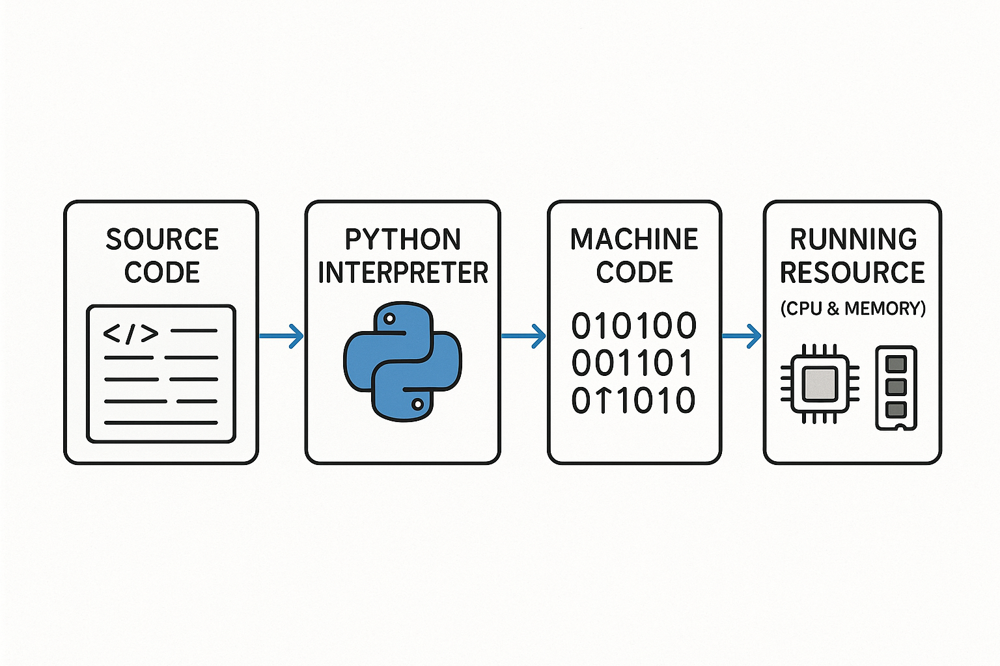

# 安裝與使用 Google Colab

# Python 程式的執行環境

+ **整合開發環境(IDE)** 編輯原始碼用
  + Thonny
  + VS Code
  + Jupyter Lab
+ **直譯器** 轉原始碼成機器碼
  + Python 3
+ **運算資源** 實際執行程式的設備
  + 雲端
  + 本機



# 雲端環境 - Google Colab
+ 整合開發環境: Google Colab notebook
+ 直譯器: 內建於 Google Colab 的 Python3 直譯器
+ 運算資源: Google cloud 提供的 CPU 和 Memory

<p class="small-text">
1. 使用自己的 Google 帳號登入並開啟「雲端硬碟」<br>
2. 點選左上「新增」→「Google Colaboratory」建立 Colab Notebook<br>
3. 若未顯示選項，點選「+ 連接更多應用程式」搜尋並安裝 Google Colaboratory<br>
4. 將檔案重新命名為 FlyPython.ipynb（ipynb = interactive Python notebook）<br>
5. 嘗試執行：輸入簡單指令並按下 `CTRL+ENTER`、`SHIFT+ENTER` 或播放鍵<br>
6. 儲存程式：點選「File → Save」或按下 `CTRL+S`<br>
7. 回到 Google Drive，確認檔案是否已儲存至雲端硬碟  
</p>

# Colab 基本操作
+ Rename file
+ Save file (CTRL + S)
+ Run cell (CTRL + ENTER, SHIFT + ENTER)
+ Delete / add / move cells
+ Add markdown text

# 📺 Google Colab 教學影片
[](https://youtu.be/eJCXFIoOwdw?si=_HyCFGAgGT4HAYlx)

# Lab: 用 Colab 寫第一個 Python 程式
+ 建立新 CoLab notebook
+ 命名為 first_python_on_colab.ipynb
+ 執行簡單數學運算，體驗互動式功能: 鍵入 20 + 4 * (3+2), 然後執行
+ 執行基本 Python 程式，理解程式運作方式: 鍵入以下程式碼, 然後執行
```python
a = 1
b = 2
print('result =', a + b)
```
+ 關閉 CoLab
+ 回 Google Drive，打開並確認程式仍可執行

# Notebook-style Python 開發環境
- Google Colab
- VS Code（搭配 Jupyter 擴充套件）
- Jupyter Notebook / Jupyter Lab

### Notebook-style IDE，以cell為執行單位，資料分析師愛用
- 副檔名為 .ipynb (Interactive PYthon NoteBook)，互動式的操作模式
- 當鍵入 <span class='blue-text'>'Hi, World!'</span> 後，執行該cell，會印出字串的字面值 Hi, World! 
- 當鍵入 <span class='blue-text'>1 + 2 + 3 + 4 + 5</span> 後，執行該cell，會執行數學運算並輸出結果 15
- 只有最後一行的運算結果會被自動顯示，若要顯示多個輸出，請使用 `print()`
```python
print("NYCU welcome you!!")
10 * 10 # 不會被顯示，因為不是最後一行
1 + 2 + 3 + 4 +5 # 只會顯示這一行結果
```