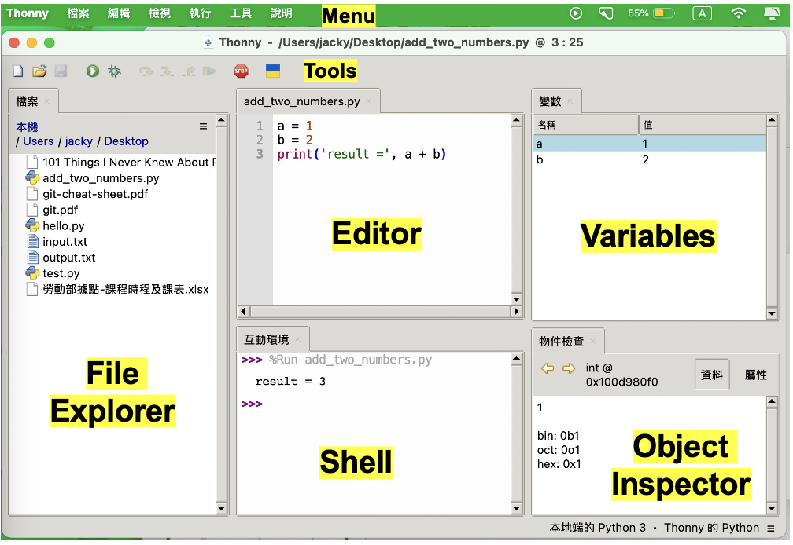

# 本機環境 - Thonny
+ 整合開發環境：Thonny editor  
+ 直譯器：內建於 Thonny 的 Python 3 直譯器  
+ 運算資源：使用本機電腦的 CPU 與 Memory

# 安裝 Thonny
1. 開啟瀏覽器，搜尋 `thonny` 或造訪 [thonny.org](https://thonny.org)  
2. 根據作業系統選擇下載（Windows / macOS）  
3. 安裝最新版本（建議 v4.1.7 或更新）  
4. 完成後點選 Thonny 圖示啟動程式  
5. 鍵入並執行以下指令：
   ```python
   print('hello world')
   ```
6. 儲存為 first_python_on_thonny.py
7. 關閉 Thonny，再次開啟並用「File → Open」重新載入該檔案

# Thonny 基本操作功能
+ Shell / Editor (編輯器) 區塊
+	上方功能表（Menu）與工具列（Tool）
+	變數/物件檢視器（Variables / Object Inspector）



# Editor vs Shell
+ 🖊 Editor
  + 程式撰寫區，輸入 Python 陳述句（Statement）
  + 若要輸出到螢幕, 需使用print()函式,才能將結果輸出到 Shell
+ 💻 Shell
  + 作為print輸出區
  + 作為實驗測試區
    + 可即時測試 Python 陳述句與運算式（Expression）
    + 可直接顯示變數內容，無需使用 print()

# Thonny 使用介紹影片
[](https://youtu.be/VLo1YM83XO8?si=2NKHxtgKnaXmA9J4)


# Lab: 使用 Thonny 印字串
使用 Thonny 鍵入以下程式並執行，存檔為 do_print.py
```python
print("  *")
print(" ***")
print("*****")
print("  |") 
```

# Lab: 使用 Thonny 做數學計算
使用 Thonny 鍵入以下程式並執行，存檔為 do_math.py
```python
num1 = 1
num2 = 2
total = num1 + num2
print("Result:", total)
```

# Coding-style Python 開發環境
- Python-specific IDE：Thonny / Pycharm / Spyder
- Code Editor: VS Code / Intellij IDEA (搭配 Python 擴充套件)

### Coding-style IDE，以整個.py檔為執行單位，軟體工程師愛用
- 副檔名為 .py
