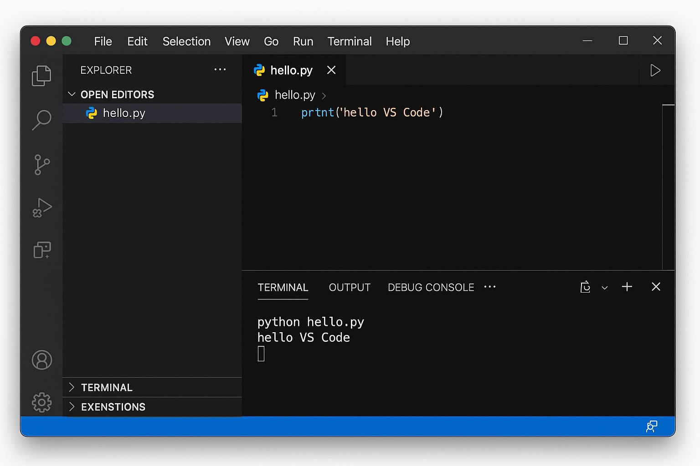

# 本機開發環境 - VS Code
+ 整合開發環境：Visual Studio Code  
+ 直譯器：需搭配安裝 Python extension 與 Python 直譯器  
+ 運算資源：使用本機電腦的 CPU 與 Memory

# 安裝 VS Code
1. 開啟瀏覽器，搜尋 `VS Code` 或造訪 [code.visualstudio.com](https://code.visualstudio.com)  
2. 根據作業系統選擇下載（Windows / macOS / Linux）  
3. 安裝完成後啟動 VS Code  
4. 前往 Extensions (⇧⌘X)，搜尋並安裝 Python 套件（由 Microsoft 開發）  
5. 安裝 Python 直譯器（建議使用 [python.org](https://python.org) 提供的版本）  
6. 建立 Python 檔案 (例如：`hello.py`) 並輸入程式碼：
   ```python
   print("hello VS Code")
   ```
7. 儲存並執行程式（可用右上角播放鍵或終端機）

# VS Code 基本功能區塊
+ 檔案總管（Explorer）
+ 編輯器（Editor）
+ 終端機（Terminal）
+ 延伸套件（Extensions）
+ 側邊列工具（Run, Source Control, Extensions）



# VS Code 編輯與執行
+ 編輯 `.py` 檔案內容
+ 使用整合終端機（Terminal → New Terminal）執行：
   ```
   python 檔名.py
   ```
+ 也可點選播放鍵自動執行目前檔案

# VS Code 教學影片
[VS Code 初學者教學](https://youtu.be/HkFlM73G-hk)

# Lab: 使用 VS Code 印出星星
使用 VS Code 建立新檔 `star_print.py`，鍵入並執行以下程式
```python
print("  *")
print(" ***")
print("*****")
print("  |")
```

# Lab: 使用 VS Code 做數學計算
使用 VS Code 建立新檔 `math_calc.py`，鍵入並執行以下程式
```python
a = 5
b = 7
print("sum =", a + b)
```
