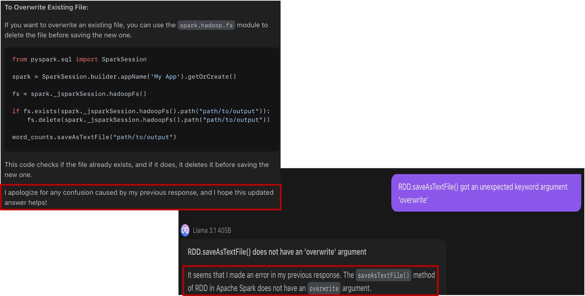

# Last But Not Least

# Python MindMap

# Python Syntax Cheatsheet

# What are the 5 signs that you aren’t made to be a professional programmer?
1. Lack of Interest in Problem Solving
2. Discomfort with Continuous Learning
3. Difficulty with Abstract Thinking
4. Poor Attention to Detail
5. Low Tolerance for Frustration

- https://www.quora.com/What-are-the-5-signs-that-you-are-not-made-to-be-a-computer-programmer

# 職場小叮嚀

- 厚臉皮: 該說No就說No, 別硬撐，有問題就問，不懂就做實驗
- 說人話: 讓別人知道你做的事，是有難度有貢獻的，挑重點說白話
- 抬頭望: 別只守著自己的田，看看隔壁鄰居的莊稼如何，有沒有新的做法，也看看有沒有偏離地主的方向，別地主想改種芋頭，而你只會種地瓜

# 簡言之，別玻璃心，懂包裝，看指揮

---
Q: 老師我主要想先詢問我自己學程式的時候有點覺得力不從心, 有種感覺不確定之後到底會不會用到，如果用不到感覺自己很像做白工，可是又擔心之後用得到現在學得不夠精

<ul class="custom-font">
  <li>我一開始教課時曾經想過，應該要設定什麼樣的教學目標，後來決定先採用入門的方式來進行課程，讓學生從這裡開始接觸資訊科技的領域，學習寫程式，畢竟只有幾十個小時，無法學得很深，但至少讓學生不要排斥學寫程式這件事，當作是投資小量的時間來試水溫。</li>
  <li>經過幾班的教學， 我發覺有些學生在專題報告時，可以通過自我學習，舉一反三，做出很進階的題目，當然有一些學生通過這個課程，在這個領域繞了一下，發覺自己並不是那麼喜歡寫程式， 但通過課程的學習，他們會知道寫程式是怎麼一回事，程式能協助解決什麼樣的問題。</li>
  <li>我認為在職場上，都會有提高人員生產力，降低服務或生產時程，減少重複性工作的需求，此時寫程式的能力應該就會派上用場，不管是Python，還是Excel 公式，巨集等，都會成為你的工具，當然更重要的是解題的思維，以及系統邏輯的訓練。</li>
  <li>因此，持續的自我學習的能力才是最重要的，有時老闆交付的任務是你沒遇見過的，如何在短時間之內，可以找到一個令人信服的解決方案，並且快速學習產生即戰力， 這才會是你跟你的同事之間的區別。</li>
  <li>就當作小時候去上畫畫課鋼琴課游泳課的心態，也不見得會有多大的用處，但也就是開開眼界，了解一下不同領域的知識，難保有一天，你被要求寫一個腳本來解決，你自己每天日常需要重複執行的工作，可能還先不用想著資料科學家，機器學習，人工智慧等，那些需要更多更多的專業訓練才能達到的目標。</li>
</ul>

# GPT Might Make Mistake

# 
