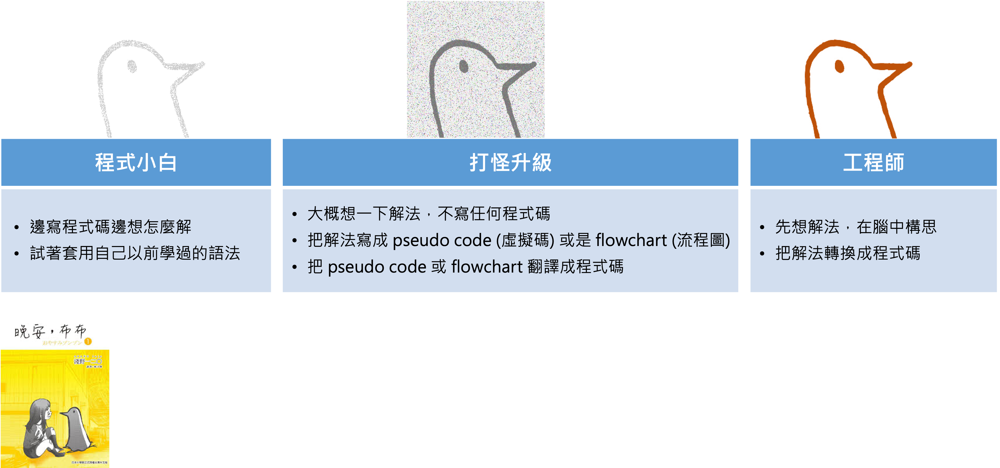
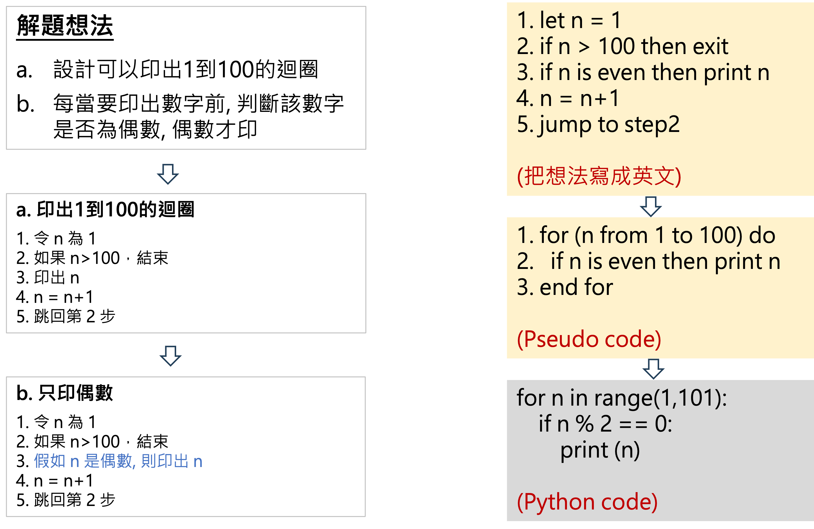
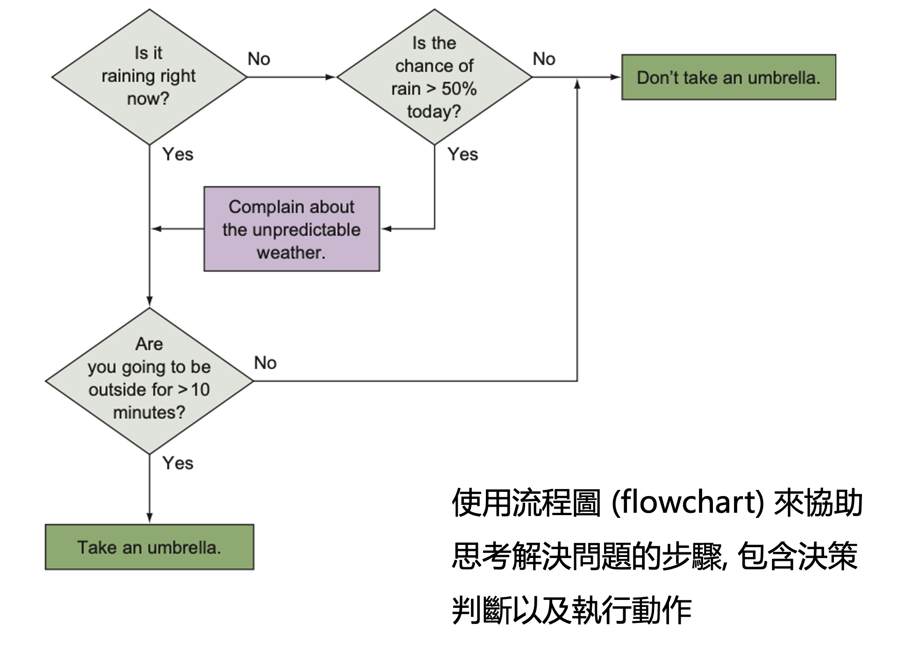
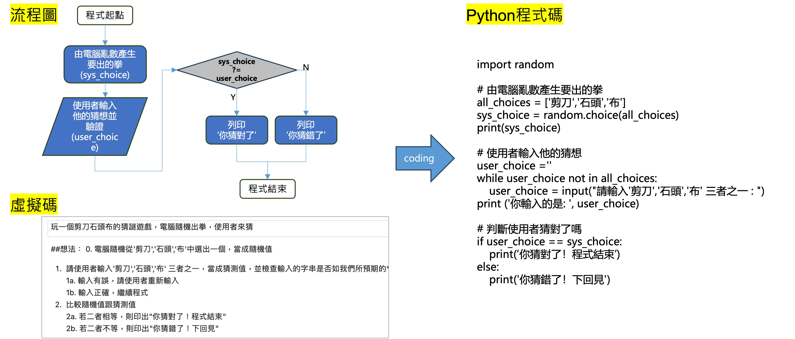
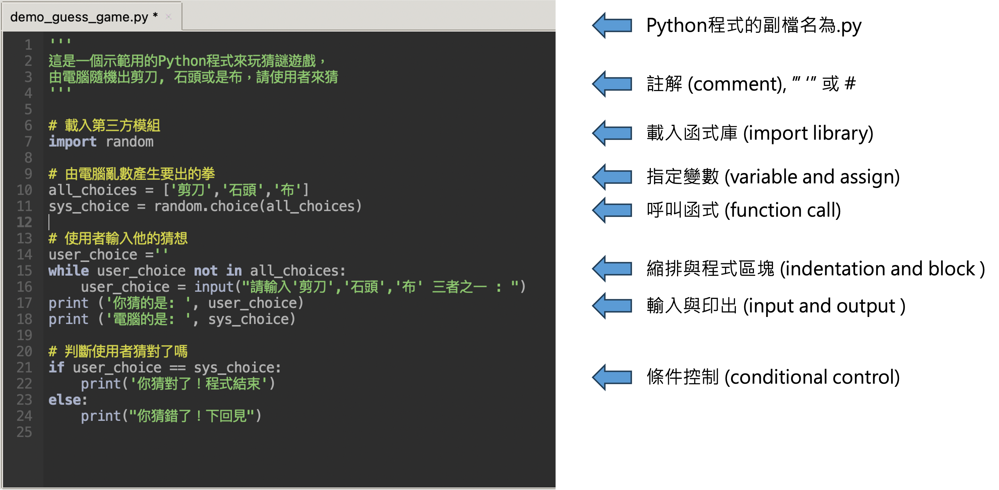

# 程式思維

# 寫程式 ≠ 寫程式碼

# 學習寫程式的道路並不容易
[走歪的工程師James影片](https://youtu.be/t35Fxn0nenU?si=ebDvv9J6ZIw8Xn9I)

# 虛擬碼 (Pseudo Code)
- 由一行行的可執行步驟組成
- 使用迴圈來重複執行步驟
- 使用條件來選擇執行步驟
### 等外送

1. 外送小哥到了嗎?  
2. 到了, 取餐 
3. 沒到, 檢查外送APP 
4. 得到APP顯示的剩餘分鐘數: N 
5. 追劇 N 分鐘 
6. 回到步驟 1 
(2, 3 是條件判斷, 6 是重複迴圈, 其餘都是步驟敘述)

# 解題想法先，再來虛擬碼, 最後寫程式

印出1到100的偶數

# 流程圖：像程式設計師一樣思考來解決問題

# Coding vs Programming

# 試著寫一個程式!!
寫一個猜謎遊戲，電腦隨機出剪刀, 石頭或是布，請使用者來猜

# 程式設計與程式語言
- 程式設計的目的是寫出一系列完整的指令(陳述), 來解決問題
- 指令的建構必須按照程式語言的規範編寫
- 每一種程式語言可以被看作是一套包含語法(syntax)和詞彙(reserved words) 的正式規範
- 人類進行「高階」思考，使用程式語言進行程式設計, 而微處理器需要詳細的指令  (以0 和 1兩個符號表達) 才能與外在世界互動，因此編譯器 (complier) 和直譯器 (interpreter) 就是連接兩者的橋樑。

# 程式設計的常見術語
- 程式 (Program): 利用一系列的指令告訴電腦如何執行工作
- 程式語言 (Program Language):一套包含語法(syntax)和詞彙(reserved words)的規範
- 語法 (Syntax): 是我們如何配置文字、標點符號與片語的規範，好讓句子能正確地被看懂
- 陳述/敘述 (Statement): 帶有動作的電腦代碼的最小單位
- 運算式 (Expression): 可以運算成為一個值的一段程式, a+b 可以運算為3 (當 a = 2, b = 1時), 4*5+3 
- 運算元(Operand)和運算子(Operator): 3 + 4 中 3 和 4 是運算元，而 + 是運算子
- 整合開發環境(IDE, integrated development environment):整合程式撰寫及執行的軟體工具

# Python程式的術語

# 穿的像個軟體工程師

https://buzzorange.com/techorange/2018/10/29/internet-company-fashion/

# Spaces vs Tabs is a big thing!
[Spaces vs Tabs](https://youtu.be/oRva7UxGQDw?si=64njr8nmPyc2GTcm)

# 前端後端傻傻分不清
[Backend vs Frontend](https://youtu.be/G-Ks1XYGyaY?si=N2HKBHyOD5fqVBvN)
