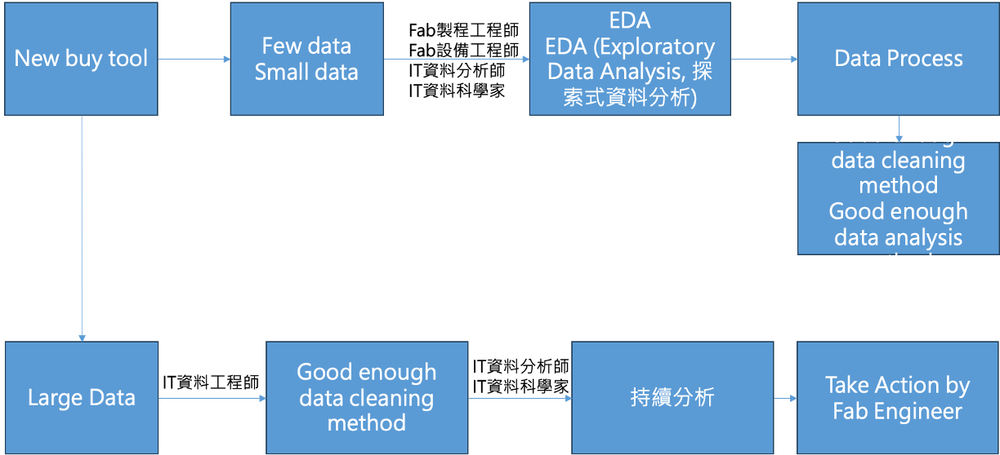

# 資料分析流程 (Data Analysis Process)
Use case: james_bond_data.csv

---
# Six Phases of Google Data Analysis

---
# A Data Analysis Workflow

---
# (1) Set Your Objects
- Objective: problem-solving, define the business problem and involved stakeholder
- Examples of problem statement
  - 了解組織如何提高新員工的留任率
  - 了解客戶滿意度如何影響我們在線商店的回客率和營收
  - 了解貸款者屬性和貸款內容如何影響貸款核准與否
  - 了解班級規模對學習成績的影響
- James Bond movie dataset 可以回答有關 007 電影的問題，包括：
  - Any relationship between the Rotten Tomatoes ratings and those from IMDb?
  - Are there any insights to be gleaned from analyzing the lengths of the movies?
  - Is there a relationship between the number of enemies James Bond has killed and the user ratings of the movie in which they were killed?

---
  # (2) Prepare
  - Collect and store data set
  - Ways to collect data
    - 問卷
    - 網路爬蟲收集外部資料
    - 銷售資料庫
    - 機台監測數據
  - Store 
    - 檔案系統 (txt, csv, json)
    - 資料庫 (SQL, NoSQL)
  - James Bond 資料集可從Google Drive 下載 "https://drive.google.com/uc?id=19Dq2YUJZHNbfUVIOXVQnMSVzKxL-Zew3"

  ---
  # (3) Process – 觀察數據集的組成
  - Clean data, transform data, check data quality
  - Process data
    - 空值的處理
    - 去除重複資料
    - 資料內容的置換
    - 調整資料格式
    - 異常值處理
  - Process 資料集
    - 了解資料集結構: df.shape, df.head()
    - 基本統計 (basic statistics) 來觀察數據分佈: df.info(), df.describe()
  
---
# (4) Analysis
- Find pattern, relationship, trend and noisy
- Analysis methods
  - 敘述統計來測量樣本和對有關的內容提供簡單的總結 (summary statistics)
    比如 mean, median, variance, range,..
  - 線性回歸
  - 資料分類和分群
  - 決策樹分析
  - 機器學習演算法
  - 時間序列分析

---
# (5) Share
- Data-driven storytelling, communication with stakeholder
- Communication
  - 資料視覺化
  - Dashboard and charting

---
# (6) Act
According to analysis result to take actions

---
# Taking Actions Based on Data Analysis Result

---
# EDA (Exploratory Data Analysis, 探索式資料分析)
- EDA 是一套包含資料處理，資料分析， 資料視覺化及統計等技術的數據分析方法， 其主要目的是從各個面向探索數據，找出回答已定義問題的線索，並進一步確認各面向間關聯，以合適的圖表與關係利害人溝通。
- EDA 通常沒有固定可依循的步驟，而是以一連串的啟發式的提問-回答的循環逐漸的釐清問題的核心，從數據中挖掘對問題深度的見解 (insights)
- EDA 常用的基本技能
  - 觀察數據集組成
  - 數據處理
  - 數據視覺化
  - 基礎統計
  - 數據分析文件化
